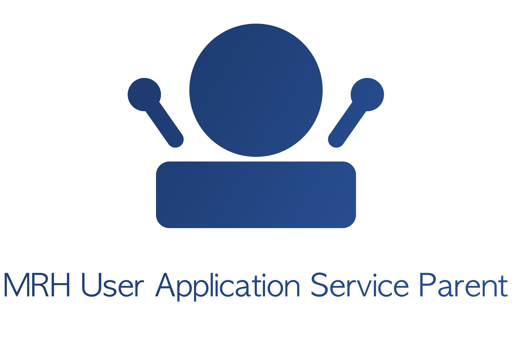

mrhuservice
===========

   
The mrhuservice application service parent is used to start and manage user 
application services. The application service parent will load a given user 
application service, set the environment for the service to run in and then 
update the service in a specified interval and send events until termination.

mrhuservice is meant to handle all underlying communication with the whole platform 
by handling things like event queue management, performing the right sequence for 
the start of any application service and more. This allows each application service 
to only focus on the functionality it wants to provide.

.. toctree::
   :maxdepth: 2
   :caption: Contents:

   Building/Building
   Run_Diagram/Run_Diagram
   Event_Handler/Event_Handler
   Service_Loading/Service_Loading
   Service_Update/Service_Update
   Service_Termination/Service_Termination
